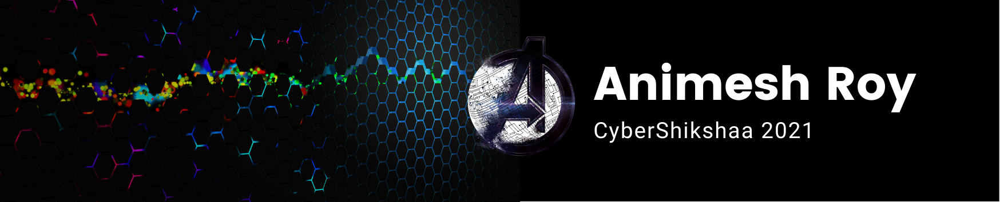

---

### [Assignments](assignments/index.md)
### [References](ref/index.md)
### [Reading Links](ref/reading.md)
### [Github tools links](ref/tools.md)
---

## Module II

### Tools

* Encryption Script [link](https://github.com/anir0y/CyberShikshaa/tree/main/module-II/encryption)

---

### Topic lists by date

|Date | Topic | Starts on |Completed on| Link|Remarks|
|---|---|---|---|---|---|
|SEP 06 2021|Cryptology|SEP 06| SEP 06 2021|[link](https://github.com/anir0y/CyberShikshaa/tree/main/module-II/Cryptology)||
|SEP 07 2021|Web Fundamentals| SEP 07|SEP 10|[link](web-technology)|Cont.|
|SEP 08 2021|Web Fundamental | SEP 08|SEP 10|[link](https://github.com/anir0y/CyberShikshaa/tree/main/module-II/dvwa)|writing basic PHP Scripts/automate attacks|

